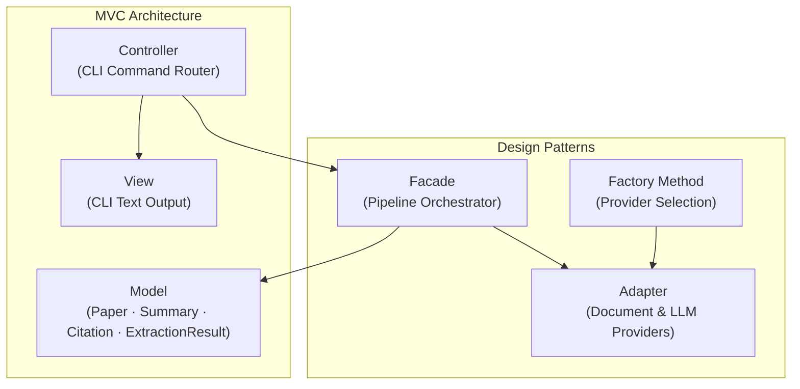

# Milestone 1 – Project Proposal

## Proposed Software Name: ScholarLens

---

## Purpose

ScholarLens is a lightweight command-line tool that ingests research abstracts or full-text papers and produces structured outputs: a concise summary, key contributions, dataset and method mentions, and an extracted citation list.

The focus is on a clean, demonstrable software architecture: the app orchestrates a document-parsing pipeline, calls an LLM for summarization and information extraction, and persists inputs/outputs/metadata in a cloud database for traceability.

---

## Target Audience

- Students and researchers who need quick overviews of papers
- Educators compiling course notes from multiple sources
- Analysts who need structured, skimmable insights from technical documents

---

## Functionalities (Initial Scope)

### 1. Summarize Paper Content

| | |
|---|---|
| **Input** | Raw text (pasted), PDF path, or URL *(stretch goal)* |
| **Output** | Short summary + bullet list of key contributions — printed to CLI and stored in cloud DB |

### 2. Extract Structured Elements

| | |
|---|---|
| **Extracts** | Dataset mentions, method/model names, and reference list (citations) |
| **Storage** | Persisted in cloud DB for later retrieval and audit |

### Optional Features *(time-permitting, not required)*

- Compare two papers (differences in contributions)
- Export a plain-text "report" artifact
- Simple search over previously processed papers

> All outputs are minimal text tables / bullet points in the CLI to keep scope tight.

---

## Design Patterns

### GoF Design Patterns

| Pattern | Category | Role |
|---------|----------|------|
| **Facade** | Structural | Pipeline Orchestrator — single entry point coordinating parsing, LLM calls, and persistence |
| **Adapter** | Structural | Document & Model Providers — normalises different input formats and LLM providers behind a uniform interface |
| **Factory Method** | Creational | Provider Selection — instantiates the correct document parser or LLM adapter at runtime |

### Architectural Pattern: MVC

```
┌─────────────────────────────────────────────────────────┐
│                        MVC                              │
│                                                         │
│  Model      →  Paper, Summary, Citation,                │
│                ExtractionResult domain objects          │
│                                                         │
│  View       →  CLI (formatted text output to stdout)    │
│                                                         │
│  Controller →  Routes CLI commands to the               │
│                Facade / Command objects                 │
└─────────────────────────────────────────────────────────┘
```



---

## Technology Stack

| Component | Technology |
|-----------|-----------|
| **Language** | Python |
| **Cloud Database** | Firestore or PostgreSQL |
| **DB Usage** | Store paper metadata, text hash, summaries, extractions, run logs, model metadata |
| **Third-Party Web Service** | LLM API — OpenAI or Hugging Face Inference API |
| **Interface** | Command-line (Python) |
