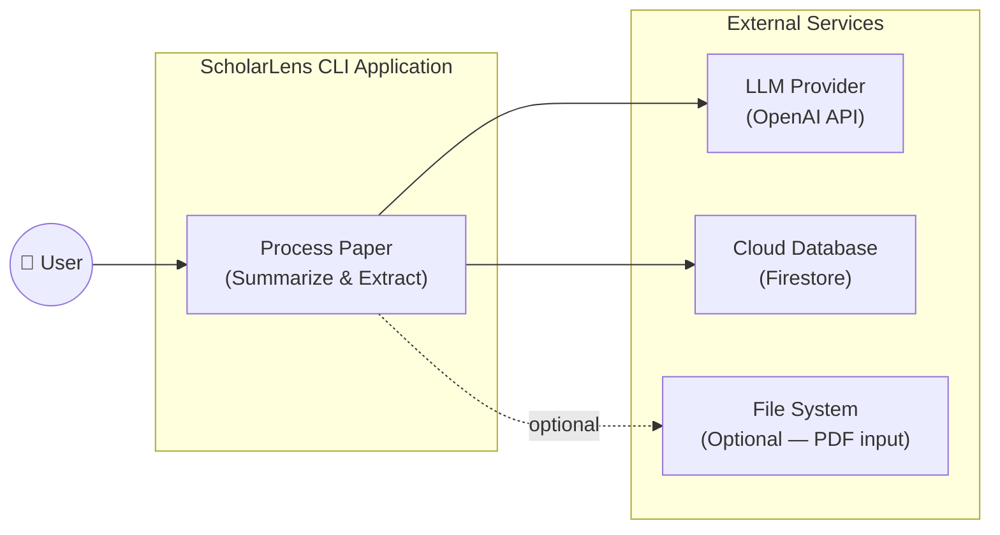
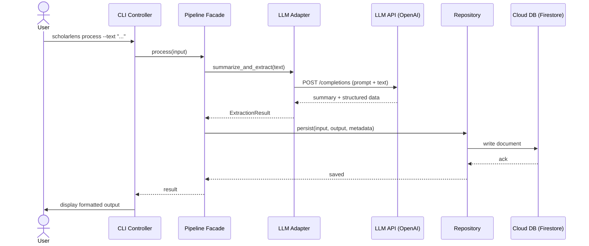
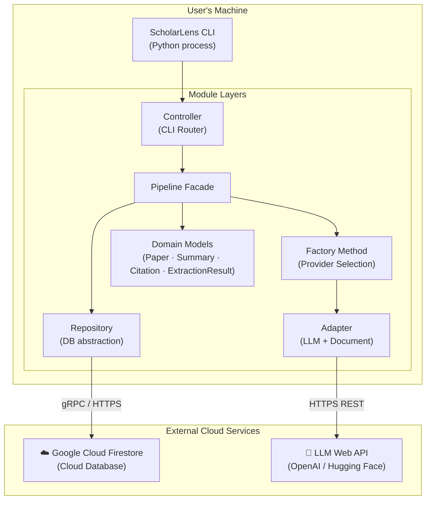

# Milestone 2 – Architecture Design

---

## Purpose & Audience

ScholarLens is a lightweight command-line tool that ingests research abstracts or full-text papers and produces structured outputs: a concise summary, key contributions, dataset and method mentions, and an extracted citation list.

The app orchestrates a document-parsing pipeline, calls an LLM for summarization and information extraction, and persists inputs/outputs/metadata in a cloud database for traceability.

**Target Audience:**
- Students and researchers who need quick overviews of papers
- Educators compiling course notes from multiple sources
- Analysts who need structured, skimmable insights from technical documents

---

## Requirements

| ID | Type | Requirement |
|----|------|-------------|
| R1 | Functional | The system shall accept paper content as raw text input via the command line. |
| R2 | Functional | The system shall generate a concise textual summary and bullet list of key contributions for a given paper. |
| R3 | Functional | The system shall extract structured elements (dataset mentions, method/model names, and citation list) from a paper. |
| R4 | Functional | The system shall persist inputs, outputs, and metadata (e.g., text hash, timestamps, model info) in a cloud database. |
| R5 | Functional | The system shall call an external LLM web API to perform summarization and information extraction. |
| R6 | Non-functional | The system shall be maintainable by organizing code into clear modules aligned with the chosen architectural pattern (MVC + Facade/Adapter/Factory). |

---

## Scenario Viewpoint

The Scenario Viewpoint captures how users interact with the ScholarLens system to fulfill its core functionality: ingesting a research paper and producing structured outputs. This viewpoint shows how the system behaves from the user's perspective and how responsibilities are distributed across architectural components.

### Use Case Diagram — "Process Paper"

This diagram illustrates the primary interaction between the user and the ScholarLens CLI application. The user initiates the "Process Paper" use case, which orchestrates multiple backend services:

- **LLM Provider (OpenAI API):** Generates summaries and extracts structured elements.
- **Cloud Database (Firestore):** Stores inputs, outputs, and metadata for traceability.
- **File System (Optional):** Supports PDF input if the user provides a file path.

The CLI application acts as the controller and orchestrator, encapsulating all use case logic.

---

## Sequence Diagram — "Summarize & Extract Paper Content"

This diagram details the internal flow of control and data across system components when a user processes a paper:

1. User input is received by the **CLI Controller**.
2. The **Pipeline Facade** coordinates the processing steps.
3. The **LLM Adapter** sends the paper text to the external LLM API.
4. The **LLM API** returns a summary and structured data.
5. The **Repository** stores all relevant data in the cloud database.
6. The **CLI Controller** displays the formatted output to the user.

Design patterns in action:
- **Facade** — simplifies orchestration behind a single `process()` call.
- **Adapter** — abstracts the external LLM API call.
- **Factory Method** (not shown inline) — selects the appropriate LLM or parser provider before this sequence begins.

---

## Physical Viewpoint

The Physical Viewpoint describes how ScholarLens is deployed and how its components interact across physical and network boundaries. This is critical for understanding runtime behaviour, external dependencies, and how the system satisfies non-functional requirements like traceability and maintainability.

### Deployment Architecture Overview

ScholarLens is a single-process CLI application running locally on the user's machine. It connects to two external services:

- A **cloud database (Firestore)** for persistent storage of inputs, outputs, and metadata.
- An **LLM web API (OpenAI)** for summarization and structured extraction.

This architecture is intentionally minimal to reduce complexity while still meeting project requirements for cloud integration and third-party service usage.

### Deployment Diagram

---

## Cloud Database Integration

The project uses **Google Cloud Firestore** for persisting all inputs, outputs, and metadata. The connection is authenticated via a service account key (`serviceAccount.json`).

**Collections written:**

| Collection | Purpose |
|------------|---------|
| `papers` | Raw input metadata (text hash, timestamp, source type) |
| `summaries` | LLM-generated summaries and contribution bullet lists |
| `extractions` | Structured elements: datasets, methods, citations |
| `run_logs` | Model metadata, run timestamps, error states |

**Verified operations:** ✅ Firestore write and read operations tested successfully via `test_firestore_db.py`.
